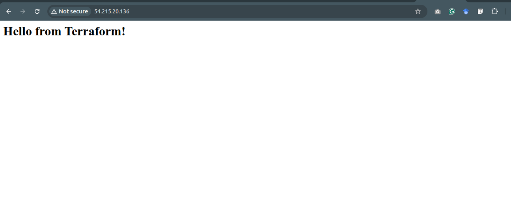
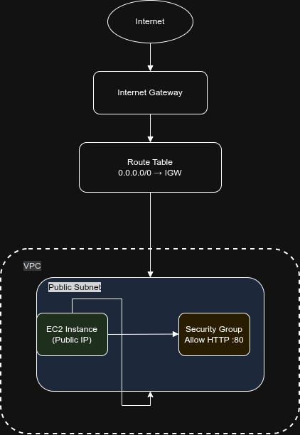

# Deploying My First Web Server on AWS Using Terraform

## 🚀 Introduction
In this project, I deployed a basic web server on AWS using Terraform. This hands-on exercise helped me understand Infrastructure as Code (IaC), cloud provisioning, and automation.

More importantly, it shifted my mindset from manual configuration → automated infrastructure design.

---


## 🧰 Tools Used
- Terraform
- AWS (EC2, VPC, Security Groups)
- Draw.io (for architecture diagram)

---
# Terraform Workflow
## 🎯 Terraform Init
Prepares Terraform environment/ initializes the project, hence setting up Terraform to run:

---
## 🎯 terraform plan
Previews infrastructure changes:
- Compares desired vs current state
- Shows what will be created
👉 Helps catch errors before deployment
---
## 📊 terraform apply
Deploys infrastructure:
- Executes the plan
- Provisions AWS resources
👉 This is where your infrastructure goes live
---

## 🌍 Step 1: Provider Configuration
Explanation:
- Defines AWS as the cloud provider
- Sets deployment region
```hcl
provider "aws" {
  region = "us-east-1"
}
```

---

## 🌐 Step 2: Create a VPC
- Creates an isolated network
- CIDR block allows scalable IP allocation

```hcl
resource "aws_vpc" "main" {
  cidr_block = "10.0.0.0/16"
}
```

---

## 🧩 Step 3: Create a Public Subnet
- Subnet is part of the VPC
- Automatically assigns public IPs to instances
```hcl
resource "aws_subnet" "public" {
  vpc_id                  = aws_vpc.main.id
  cidr_block              = "10.0.1.0/24"
  map_public_ip_on_launch = true
}
```

---

## 🌍 Step 4: Internet Gateway
- Enables internet communication
- Required for public access

```hcl
resource "aws_internet_gateway" "igw" {
  vpc_id = aws_vpc.main.id
}
```

---

## 🛣️ Step 5: Route Table
- Routes all external traffic to the internet
- Makes subnet internet-accessible

```hcl
resource "aws_route_table" "rt" {
  vpc_id = aws_vpc.main.id

  route {
    cidr_block = "0.0.0.0/0"
    gateway_id = aws_internet_gateway.igw.id
  }
}
```

---

## 🔗 Step 6: Associate Route Table
- Links subnet to route table
- Enables internet routing

```hcl
resource "aws_route_table_association" "rta" {
  subnet_id      = aws_subnet.public.id
  route_table_id = aws_route_table.rt.id
}
```

---

## 🔐 Step 7: Security Group
- Acts as a firewall
- Allows HTTP traffic (port 80)

```hcl
resource "aws_security_group" "web_sg" {
  vpc_id = aws_vpc.main.id

  ingress {
    from_port   = 80
    to_port     = 80
    protocol    = "tcp"
    cidr_blocks = ["0.0.0.0/0"]
  }

  egress {
    from_port   = 0
    to_port     = 0
    protocol    = "-1"
    cidr_blocks = ["0.0.0.0/0"]
  }
}
```

---

## 🖥️ Step 8: EC2 Instance
- Dynamically fetches latest AMI
- Launches EC2 instance
- Installs and runs Apache automatically
  
```hcl
data "aws_ami" "amazon_linux" {
  most_recent = true
  owners      = ["amazon"]

  filter {
    name   = "name"
    values = ["al2023-ami-*-x86_64"]
  }
}

resource "aws_instance" "web" {
  ami                         = data.aws_ami.amazon_linux.id
  instance_type               = "t2.micro"
  subnet_id                   = aws_subnet.public.id
  vpc_security_group_ids      = [aws_security_group.web_sg.id]

  user_data = <<-EOF
              #!/bin/bash
              yum install -y httpd
              systemctl start httpd
              systemctl enable httpd
              echo "<h1>Hello from Terraform!</h1>" > /var/www/html/index.html
              EOF
}
```

## ⚙️ Step 9: Initialize & Deploy
Run these commands:
Type yes when prompted

```hcl
terraform init
terraform plan
terraform apply
```

---

## 🌐 Step 10: Access Your Website
- Displays public IP after deployment
- Used to access the web server

```hcl
terraform show
```
**Look for:**
```hcl
public_ip = "X.X.X.X"
```
**Open in browser:**
```hcl
http://<your-public-ip>
```
You see:
```hcl
Hello from Terraform!
```


# 🛠️ Challenges & Fixes
### ❌ 1. Security Group Not Found

#### Error: InvalidGroup.NotFound

#### Cause: Hardcoded Security Group ID

#### Fix:
```hcl
pvpc_security_group_ids = [aws_security_group.web_sg.id]
```
### ❌ 2. Invalid AMI ID

#### Error: InvalidAMIID.NotFound

#### Cause: AMI not available in region

#### Fix: 
Used dynamic AMI:
```hcl
ami = data.aws_ami.amazon_linux.id
```
---
### ❌ 3. Subnet Not Found

#### Error: InvalidSubnetID.NotFound

#### Cause: Hardcoded subnet ID

#### Fix: 
```hcl
subnet_id = aws_subnet.public.id
```
---
## 🏗️ Architecture Overview

- AWS Cloud (us-east-1)
- Custom VPC
- Public Subnet
- Internet Gateway
- Route Table
- Security Group (Port 80 open)
- EC2 Instance (Web Server)

  

---

## 🎯 Conclusion

This project helped me understand:
- How to provision infrastructure using Terraform
- Networking basics in AWS (VPC, subnets, routing)
- Automating server setup with user data scripts

---
